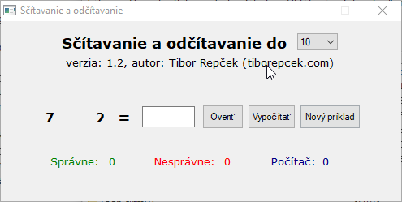

# Sčítavanie a odčítavanie

Autor: Tibor Repček

Web: https://tiborepcek.com/scitavanie-odcitavanie/

Sčítavanie a odčítavanie je programček, ktorý náhodne vyberá príklady na sčítavanie a odčítavanie s výsledkom od 10 do 100. Vy zadáte výsledok, program ho skontroluje a ak je správny, priráta zelený bod. Nesprávny výsledok je ohodnotený červeným bodom. Ak necháte príklad vypočítať za vás počítač, priráta sa modrý bod.

Tento program je napísaný v skriptovacom jazyku [AutoIt 3](https://www.autoitscript.com/) a primárne je určený pre operačný systém Windows (testované na XP až 8). Funguje však aj cez [Wine](https://www.winehq.org/) v Linuxe (testované na [Mint](http://www.linuxmint.com/) 17.1) a bol úspešne odskúšaný tiež na Apple MacBook Air 11 s operačným systémom Mac OS X Yosemite (10.10.2) pomocou [WineBottler](http://winebottler.kronenberg.org/).
